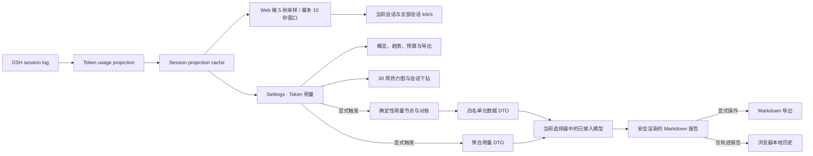

# dsh-token-usage

> [!IMPORTANT]
> **本仓库是个人二开（fork）仓库，不是原作者仓库，也不是官方发布。**
>
> 本仓库由 [@yumimanji](https://github.com/yumimanji) 从上游 [LeemanCheung/dsh-token-usage](https://github.com/LeemanCheung/dsh-token-usage) fork 而来，仅用于个人的二次开发与实验，并以 `@hello_wk/dsh-token-usage` 发布到 npm。**请勿将本仓库的功能、缺陷或发布版本归因于原作者。**
>
> - 上游作者：**LeemanCheung**；原始项目与原始文档以上游仓库为准。
> - 上游的问题与建议请提到[上游 Issues](https://github.com/LeemanCheung/dsh-token-usage/issues)；本二开引入的改动与问题请提到[本仓库 Issues](https://github.com/yumimanji/dsh-token-usage/issues)。
> - 本项目沿用上游的 [MIT](LICENSE) 许可证，原始版权归 LeemanCheung 所有，详见 [License](#-license)。
> - 与上游的差异记录在 [CHANGELOG.md](CHANGELOG.md) 与下文的「二开说明」。
>
> **This is a personal fork, not the original author's repository.** Forked from [LeemanCheung/dsh-token-usage](https://github.com/LeemanCheung/dsh-token-usage) by [@yumimanji](https://github.com/yumimanji) for personal secondary development, and published to npm as `@hello_wk/dsh-token-usage`. The upstream repository is authoritative for the original project; the MIT license and the original copyright (LeemanCheung) are retained.

<p align="center">
  <a href="https://awesome.re"></a>
  <a href="https://awesome-dsh-plugin.com"></a>
  <a href="https://github.com/deepseek-ai/deepseek-harness"></a>
  
  
  
  
  <a href="LICENSE"></a>
</p>

<p align="center">
  <strong>面向 <a href="https://github.com/deepseek-ai/deepseek-harness">DeepSeek Harness</a> 的本地优先 Token 可观测性、预算与轨迹审计插件。</strong><br>
  持久统计四类 provider Token bucket，提供趋势、预算、公开费率估算、聚合导出，并通过模型目录当前选中的已接入路由按需生成用量和会话轨迹报告。
</p>

<p align="center">
  <a href="#二开说明">二开说明</a> ·
  <a href="#功能全景">功能全景</a> ·
  <a href="#功能截图">功能截图</a> ·
  <a href="#安装">安装</a> ·
  <a href="#ai-token-用量分析">AI 用量分析</a> ·
  <a href="#会话-token-轨迹分析">轨迹分析</a> ·
  <a href="#已知限制">已知限制</a> ·
  <a href="#贡献与社区">贡献与社区</a> ·
  <a href="SECURITY.md">安全</a>
</p>

<p align="center">
  
</p>

> 截图采集自当前 DSH 界面；采集前已将用量、日期、路由与报告内容替换为明确标注的示例数据，不对应真实会话、模型配置或账单。

<a id="功能全景"></a>
## 🗺️ 功能全景

| 领域 | 已实现能力 |
| --- | --- |
| **本地用量工作台** | 无模型体检、用量收据、版本化价卡、独立辅助分析账本、7/30/90 日变化贡献、项目/标签与金额预算、人工验收实验、缓存/分时试算、脱敏周报，以及默认关闭的同页面只读摘要。详见 [工作台说明](docs/workbench.md)。 |
| **精确记账** | 分别记录未缓存输入、输出、缓存读取与缓存写入；`reasoningTokens` 已包含在输出中，不重复计算。流式 usage 先作为临时值，最终消息在同一 attempt 内覆盖它；重试与上下文压缩独立计数。 |
| **多维聚合** | 以 provider / model、会话、UTC 日期和日期×模型聚合普通对话、每次重试和上下文压缩；旧用量无法归因时单独披露，不破坏总量守恒。 |
| **概览与活跃度** | 八项概览指标覆盖总量、输入、输出、缓存结构、公开费用、缓存读取避免费用、费率覆盖和有用量会话；30 周热力图支持四类 bucket 悬停与按日会话下钻。 |
| **近实时确认输出** | Web 端每 5 秒统一采样 provider 已确认的会话输出 bucket，以最多 10 秒窗口平滑突发入账；对话标题区显示当前会话 `tok/s`，侧栏底部显示全部会话合计和近期有入账的会话数。仅在请求终态上报 usage 的路由会在请求结束后形成脉冲，不代表逐 Token 解码速度。 |
| **趋势与数据质量** | 支持全部路由或单个 provider/model 的 7/30/90 日环比、活跃天数和峰值日；日期×模型 bucket 必须同时与会话总量、模型总量和逐日总量守恒，覆盖不完整或不一致时自动降级，避免旧数据造成低估。 |
| **预算与异常** | 本机持久化全局及精确 provider/model 的滚动 30 日 Token 预算；模型预算提供 80% 预警、100% 超额和 7 个完整 UTC 日运行率预测，并只在日期×模型覆盖完整且守恒时启用。全局异常仍以中位数/MAD 识别近期突增并支持按日下钻。 |
| **Agent 效率** | 展示模型尝试数、每次尝试 Token、每百次尝试压缩数、精确压缩 Token 占比、缓存读取占输入、Top 1/Top 3 路由集中度和未归因比例。 |
| **公开价格估算** | 用静态公开费率计算已覆盖路由的 USD 估算与缓存读取避免费用，明确显示费率基准日、Token/路由覆盖和未覆盖项；不冒充 provider 账单。 |
| **模型与会话工作流** | 模型表支持按总 Token、公开费用、每次记录调用 Token 或缓存占比排序；会话表支持搜索、渐进展开、直接打开会话，轨迹分析操作固定在第一列。 |
| **聚合导出** | 导出不含会话正文和标题的 JSON v3、每日 CSV、模型 CSV 与日期×模型 CSV；JSON v3 显式记录逐日/日期×模型覆盖状态，不完整或守恒失败时禁用日期×模型 CSV，避免生成看似完整的低估数据。CSV 单元格防公式注入。 |
| **AI 用量优化** | 使用目录自动预选的默认/首个路由，或改选任一当前可列出的已接入 provider/model，对总量、压缩、缓存、路由贡献、可靠日趋势、峰值和波动生成证据化建议；目录可刷新，单个 provider 枚举失败不影响其他路由。 |
| **会话轨迹分析** | 可从设置页会话列表或对话页标题操作区启动同一 Host 流程；同时支持 live 与冷会话，确定性分析调用节点、重试、压缩、工具可靠性、速率、生命周期和 Token 对账。 |
| **合规控制审计** | 配对审批请求与决定，统计单次允许、拒绝、取消、不可用、未闭合和孤立决策；单次决定不存在“永久允许”结果；独立的会话级 `approval/policy` 事件不在当前报告白名单中，因此持久策略明确标为不可用证据。报告强制区分观测证据、风险假设与不可用证据，不声称法律或认证结论。 |
| **实时分析进度** | 两类模型分析均显示准备/生成/整理阶段、等待时间、流块、字符数和输出 Token；provider usage 到达前明确标注估算值，到达后切换为精确值。缺少终态 finish 的截断流会失败；成功或取消后立即停止轮询且不发布迟到快照。最多同时维护 8 个请求级进度记录，结束即清理。 |
| **报告、导出与历史** | 使用 DSH Markdown 组件展示标题、列表、表格与代码；远程图片降级为链接、原始 HTML 转义为文本。两类报告均可导出；轨迹报告在当前浏览器配置中全局最多保存 24 条，界面按当前会话过滤查看并支持删除。 |
| **紧凑、响应式与可访问 UI** | 跟随 DSH 中/英文界面并适配窄屏；大数字使用 `K` / `M` / `B` 且悬停保留精确值，轨迹摘要分为四组；加载状态提供 `aria-live`、`aria-busy` 和 reduced-motion 兼容。 |
| **历史预热与生命周期** | Host 启动后顺序预热可读历史并写入 projection cache，不阻塞插件启动；模型目录、调用与中止信号绑定当前 LLM service 生命周期。 |
| **隐私与边界校验** | 持久 projection 只保存统计数据；模型仅接收最小聚合 DTO 或白名单轨迹元数据。私有 RPC 只允许 loopback 页面，非法 bucket、日期、路由、进度 ID 和超限数组会在读取会话或调用 Adapter 前拒绝；Client 会验证报告 schema、时间戳、bucket、节点、signed delta 与最大节点引用。 |

### 该插件如何工作，以及不做什么

- **被动账本，不拦截请求**：Host 侧观察普通模型请求、重试和压缩事件，构建可恢复的会话统计 projection；预算、异常和建议只展示证据，不会阻止模型调用或改写路由。
- **按需 AI，不是后台画像**：聚合用量分析和单会话轨迹报告都必须由用户显式启动；前者只发送有界聚合 DTO，后者只发送白名单事件元数据。提示词、回复、标题、路径、工具参数和原始 provider/model 不会进入模型证据。
- **估算不等于账单或合规结论**：USD 数字只按本地静态公开费率计算，报告中的审批统计也只陈述观测到的事件与证据缺口；两者都不替代 provider 账单、策略执行或认证审计。

<a id="功能截图"></a>
## 🖼️ 功能截图

### 趋势、效率、运行率与预算

<p align="center">
  
</p>

<p align="center">
  
</p>

### AI 用量分析入口与模型热点

<p align="center">
  
</p>

> 选择的路由只在用户点击生成后调用；目录失败可重试，也不会静默改用默认模型。

<a id="会话轨迹报告与浏览器本地历史"></a>
### 会话轨迹报告与浏览器本地历史

<p align="center">
  
</p>

> 轨迹截图使用示例会话指标，展示限制在视口内的滚动预览、完成态摘要、Markdown 表格与导出；继续向下滚动可查看浏览器本地历史，不对应真实会话内容。

<a id="安装"></a>
## 🚀 安装

```powershell
# 方式一：本二开仓库源码安装（当前可用）
dsh plugin --profile web add github:yumimanji/dsh-token-usage

# 方式二：npm 安装（本二开版本发布后可用）
dsh plugin --profile web add @hello_wk/dsh-token-usage
```

> 上游原版安装命令为 `dsh plugin --profile web add github:LeemanCheung/dsh-token-usage`。本二开与上游是**不同来源、不同包名**，请按需选择；不要混用两者的包名或 Issue 地址。

安装后重启当前 `dsh web` 进程并刷新 [http://127.0.0.1:3080](http://127.0.0.1:3080)，再打开 **设置 → Token 用量**；新增功能位于 **设置 → 用量工作台**。

<details>
<summary>本地源码开发安装</summary>

在本目录的上一级运行：

```powershell
dsh plugin --profile web add ./dsh-token-usage
```

</details>

### 兼容性、存储与卸载

- `0.5.0` 源码已验证兼容 DSH `0.1.2-rc.1` 的 Session Controller、Client Store、UI Renderer 与 Connection 接口，验证范围见 [`docs/compatibility-0.1.2-rc.1.md`](docs/compatibility-0.1.2-rc.1.md)。CLI 或非 Web profile 不提供仪表盘。
- 桌面版 DeepSeek Harness 内置的是 DSH `0.2.0-rc.2`。本二开已把 peer 范围放宽到 `^0.1.2-rc.1 || ^0.2.0-rc.2` 以便在该版本加载；但 0.2.0-rc.2 **只做了静态 API 表面核验，未做端到端实测**，因此标记为 `surface-checked` 而非 `compatible`，详见 [`docs/compatibility-0.2.0-rc.2.md`](docs/compatibility-0.2.0-rc.2.md)。
- 若 DSH 以 `incompatible-version` 拒绝加载，说明当前 DSH 版本不在上面的 peer 范围内：先确认 `dsh --version` / 桌面版实际版本，再用 `dsh plugin allow-version` 或插件管理器授予**精确版本豁免**，然后重试安装或重启 DSH。不要靠改 `docs/` 里的说明来绕过校验。
- 标题栏和侧栏速率继续表示最近最多 10 秒内由 Provider 确认并写入投影的输出 Token 增量，每 5 秒刷新；缺少投影、计数回退、来源切换和计时器挂起都会重新采样，不把估算值写成真实入账。
- 原有 Token 用量与轨迹报告的数据分为三层：Host 的会话 projection 聚合统计、DSH settings 中的全局与精确路由滚动 30 日预算（`token-usage.rolling30DayBudget` / `token-usage.routeBudgets`），以及当前浏览器 `localStorage` 中最多 24 条的轨迹报告（`dsh-token-usage.trajectory-history.v1`）。聚合 AI 用量报告不会持久化。
- 卸载是移除插件挂载，并不是数据重置流程。若要减少本地残留，请先在轨迹历史中删除报告、将预算清零，再按 DSH 自身的 session/cache 保留策略处理 projection 数据。

```powershell
# 用当初安装时的同一个 spec 移除
dsh plugin --profile web remove @hello_wk/dsh-token-usage

# 源码安装的则用
dsh plugin --profile web remove dsh-token-usage
```

> 若不确定当初安装用的 spec，查看 profile 目录 `package.json` 的 `dependencies` 与 `dsh.profile.bundles` 中实际记录的名字，再按该名字移除。

卸载后重启 `dsh web` 并刷新页面；已有会话历史仍存在，但仪表盘和自定义分析入口需要重新安装此插件才能显示。

## 📊 仪表盘内容

- **概览卡片**：总 Token、输入 Token、输出 Token、缓存读取占输入、有用量会话数，以及已覆盖路由的公开 USD 估算、缓存读取避免费用和 Token 费率覆盖率。
- **近实时确认输出**：同一浏览器控制器每 5 秒读取已推送的会话 projection，以最多 10 秒 `outputTokens` 增量计算速率；对话标题区显示当前会话，侧栏底部显示全部会话合计与近期入账数量。首次挂载先建立基线；projection 回退、来源切换、暂时缺失后重现或时钟异常时都会为该会话建立新 epoch，不跨口径显示假速率。当前 strict session 的 projection 会补充进共享控制器，因此只存在于 addressed 子会话视图、未带 projection 的合成列表行也能计量。该指标只计算 provider 已确认用量；如果路由仅在请求结束时给出 usage，它显示的是完成后的入账速率，不是生成过程中的逐 Token 解码速度。
- **Token 活跃度与下钻**：最近 30 周按 UTC 日汇总的热力图；悬停方格查看四类 bucket，点击查看当天总量和贡献会话。旧版内置 projection 缺少逐日数据时，仍会以会话最后活动日保留历史总量，但该日期会从运行率/异常口径排除。
- **周期趋势**：切换 7/30/90 日窗口，查看当前周期总量、环比、活跃天数与峰值日；日期×模型 bucket 完整时可按精确 provider/model 筛选，覆盖不完整时选择器会停用并说明原因。
- **用量信号**：仅在全部纳入统计的会话都有真实逐日 bucket 时，按最近 7 个完整 UTC 日计算日均和预计 30 日运行率；昨天的完整日会与此前 28 日至少 5 个活跃日的中位数/MAD 稳健基线比较，异常日可直接下钻会话。覆盖不完整时会明确显示不可用，而不是低估。
- **30 日预算**：全局预算与精确 provider/model 预算写入本机 DSH settings。全局预算在逐日覆盖完整时显示消耗和预测；模型预算达到 80% 时预警、达到 100% 时标记超额，并按最近 7 个完整 UTC 日预测超额。模型预算只有在日期×模型 bucket 与会话/路由/日期三组总量全部守恒时才计算，配置仍可保留。
- **Agent 效率与归因**：显示模型尝试数、每次尝试 Token、每 100 次尝试压缩数、精确压缩 Token 占比、缓存读取占输入、Top 1/Top 3 路由集中度及未归因比例。
- **价格统计**：显示已覆盖路由的估算 USD 成本、缓存读取避免费用、按 Token 计算的费率覆盖率，以及每条模型路由的估算成本；未覆盖路由明确显示 `—`。
- **AI Token 用量分析**：使用目录自动预选的默认/首个模型，或改选另一个已接入模型，按需生成总量、精确压缩开销、输入/输出/缓存、路由集中度、可靠日趋势、峰值、波动和 Token 优化建议报告。报告按 Markdown 结构渲染并可导出；生成中显示准备/生成/整理阶段、等待时间，以及估算或 provider 上报的精确输出 Token。模型目录可手动刷新；provider 目录并发读取并以 5 秒隔离挂起项，同一 provider 的未决枚举会在重复刷新间复用；挂起 30 秒后最多补发一次并行恢复调用，永久挂起时最多保留两次底层调用，避免无限累积；整个 RPC 短暂失败后也可直接重试，不让单个提供方阻塞其他可用模型。
- **模型用量**：按 provider / model 汇总普通模型尝试、上下文压缩次数、总量、输入与输出；可按总 Token、已覆盖的估算费用、每次记录调用 Token 或缓存读取占输入排序。
- **聚合导出**：导出不含会话标题和正文的 JSON v3（含压缩 bucket、日期×模型 bucket、逐日/日期×模型覆盖状态、公开费率覆盖和路由估算）、每日 CSV、模型 CSV 或日期×模型 CSV；日期×模型覆盖不完整或守恒失败时该 CSV 会停用。模型 CSV 含已覆盖路由的费用/缓存避免费用，CSV 单元格防公式注入。
- **会话记录**：轨迹分析操作位于表格第一列；可搜索会话标题、会话 ID 或模型路由，初始最多显示 50 条并可渐进展开，也可直接打开会话。

### 统计口径

| 指标 | 计算方式 |
| --- | --- |
| 输入 Token | `uncachedInputTokens + cacheReadTokens + cacheWriteTokens` |
| 总 Token | 输入 Token + `outputTokens` |
| 缓存读取占输入 | `cacheReadTokens / 输入 Token`；这是 Token 结构比例，不是请求级缓存命中率 |
| 输出 Token | 使用 provider 上报的 `outputTokens`；不另加 `reasoningTokens` |
| 近实时确认输出 | 最近最多 10 秒 `outputTokens` 增量 ÷ 实际采样间隔；每 5 秒刷新，按会话、计量来源和连续 epoch 计算后求和。只代表已确认输出入账，不把终态脉冲表述为逐 Token 解码速度 |
| 压缩 Token | 所有 `compaction/summary` provider usage 的四个 bucket 之和；与普通模型尝试分别计数 |
| 每次模型尝试 Token | `(总 Token - 压缩 Token) / assistantRequests`；重试是独立尝试。若存在未归因旧用量，因缺少对应尝试次数而不显示该比率。 |

同一请求步骤若先后出现流式 usage 与最终消息 usage，最终值会替换该步骤的临时值，避免重复记账；发生 `llm/retry` 后，每个重试尝试仍会被独立统计。每条 `compaction/summary` 都计为一次压缩；provider 未附 usage 时只增加次数，不虚构 Token。带 `surfaceOp: replace` 的消息只改写可见会话表面，不代表新的模型或工具执行，因此不会重复计数。

## 📈 运行率、异常与 Agent 效率

- **运行率**：仅在逐日覆盖完整时，使用真实逐日 bucket，并取最近 7 个完整 UTC 日（不包含尚未结束的今天）计算日均，再乘以 30 得到滚动 30 日预测；它是 Token 运行率，不是账单预测。
- **预算预测**：全局预算使用完整逐日 bucket；精确模型预算使用完整且守恒的日期×模型 bucket。两者都分别提示当前超额和“按当前运行率将超额”；模型预算另在消耗达到 80% 时预警。预算始终是被动提示，不会自动阻止模型调用。
- **异常检测**：将昨天这个完整 UTC 日与此前 28 日内的活跃完整日比较。至少需要 5 个活跃基线日；使用活跃日中位数和 MAD，MAD 为 0 时采用 3×中位数阈值。异常提示会显示绝对超量和倍数，并可下钻现有的按日会话贡献。
- **效率/集中度**：Top 1/Top 3 是全部 Token 的路由份额；未归因用量会单独披露。每次模型尝试 Token 从可归因总量扣除精确压缩 Token 后计算，重试属于独立尝试。
- **会话工作流**：会话名称可直接打开当前仍在列表内的会话；若会话在点击前消失，保持设置页面并显示失败原因。初始列表只渲染 50 行，聚合统计仍覆盖全部会话。

## 💵 公开价格统计

成本是**静态公开费率估算，不是 provider 账单**。内置表以 USD / 1M Token 计价，当前按精确 `provider: 'openai'` 与 model 标签匹配：`gpt-5`、`gpt-5-mini`、`gpt-5-nano`、`gpt-4.1`、`gpt-4.1-mini`、`gpt-4.1-nano`、`gpt-4o` 和 `gpt-4o-mini`（及列出的 API 版本别名）。费率依据 [OpenAI 官方 API Pricing](https://developers.openai.com/api/docs/pricing)，表内最近基准日为 **2025-08-07**，不会联网实时刷新；标签匹配不能验证实际端点、转售关系、合同或账单。

```text
估算 USD = 未缓存输入 × inputRate
         + 输出 × outputRate
         + 缓存读取 × cacheReadRate
         + 缓存写入 × cacheWriteRate
         ÷ 1,000,000
```

- 仅当 provider 和 model 标签均精确匹配内置表时才计价，不借用相似模型价格；匹配结果仍可能对应代理或自定义端点，因此必须结合实际账单核验。
- 费率覆盖率按已匹配路由的四类 Token / 全部四类 Token 计算；未覆盖 Token 不进入估算总额，页面会同时显示覆盖 Token 和有用量路由数，部分覆盖不会四舍五入为 100%。它不是实际消费金额覆盖率，不能据此外推未知价格。
- 缓存读取避免费用仅对已匹配路由计算：`cacheReadTokens × max(inputRate - cacheReadRate, 0) / 1M`；它比较同一静态公开表中的未缓存输入价，不是账单返还。
- OpenAI 路由没有单独公开的 cache-write 费率时，cache-write 按普通输入费率估算；每条路由的悬停说明会显示所用四项费率与基准日。
- 原「Token 用量」页按内置静态表重估历史聚合，不还原历史账单。新增「用量工作台」支持版本化自定义价卡，以及全局和项目的滚动 30 日 USD/CNY 预算；金额按当前费率重估，币种不相加，覆盖不足时不显示预算内。
- 价格计算、页面展示和 JSON v3/模型 CSV 只在本地浏览器中使用已持久化的聚合 bucket；价格匹配、覆盖率、估算 USD 和缓存读取避免费用都不会作为外部分析模型的证据，也不会新增会话正文、提示词或响应数据的收集。

<a id="ai-token-用量分析"></a>
## 🤖 AI Token 用量分析

在仪表盘的 **AI Token 用量分析** 卡片中，目录会自动预选默认路由或首个可用路由；可直接使用，也可改选另一个当前已接入且可列出的 provider/model，再点击 **生成用量分析**。可使用 **刷新模型目录** 重新读取实时路由；当前选择也用于下面的设置页会话轨迹分析，但每次分析仍需单独触发。目录仅负责选择和展示，真正生成时仍由 Host LLM adapter 校验路由。[查看界面截图](#功能截图)。

报告固定覆盖：

| 分析面 | 依据与输出 |
| --- | --- |
| 总量与结构 | 未缓存输入、输出、缓存读取和缓存写入的占比与变化，以及精确上下文压缩 Token 总量。 |
| 路由贡献 | 按报告内 `route-N` 别名的 Token、对话次数和压缩次数识别集中度与高消耗路由；不向模型暴露原始路由名。 |
| 时间趋势 | 仅在逐日覆盖完整时，用真实逐日 bucket 分析 UTC 日粒度的活跃度、峰值与波动；长历史最多取最新 366 天进入模型证据。 |
| 风险与不确定性 | 明确数据覆盖边界，不虚构价格、延迟、质量或因果。 |
| 优化建议 | 3–7 条带 P0/P1/P2、证据、预期 Token 效率收益、置信度和实施工作量的建议。 |

### 聚合数据、隐私与费用

- 用量分析只发送总 Token bucket、精确压缩 Token bucket、报告内 `route-N` 别名、对话/压缩次数和可靠的 UTC 每日 bucket；本地价格匹配、覆盖率、估算 USD、缓存读取避免费用和路由成本均不发送。原始 provider/model、会话 ID、标题、提示词、回复、工具参数或其他会话正文同样不会发送。
- 模型证据最多保留 Token 最大的 48 条路由记录与最新 366 条日期记录；总量仍来自完整仪表盘聚合。
- 报告和辅助调用用量仅驻留当前页面内存，刷新后消失，不进入会话日志或 projection cache；用户可显式下载 Markdown 报告。导出文件名只包含报告类型和 UTC 生成时间，不使用会话标题、会话 ID 或模型返回内容。模型 Markdown 通过 DSH 安全渲染器展示，远程图片语法在页面和导出文件中都会退化为普通链接，原始 HTML 会转义为文本，避免自动发起外部资源请求。
- 用户选择的 provider/model 会实际产生一次辅助模型调用；生成中显示阶段、等待时间、流块、字符数和明确标注的估算输出 Token，收到 provider usage 后改为精确值；完成报告继续显示调用 provider/model、辅助调用总 Token 与模型输出 Token。用量分析最多生成 2,600 Token。
- 目录只显示已接入且当前可列出模型的路由。单个提供方的目录失败不会隐藏其他可用路由，页面会披露受影响的提供方但不暴露适配器错误细节；调用失败时不会悄悄改用默认模型。
- 目录用于用户选择和展示；实际调用以 Host LLM adapter 的 `prepareCall` 为准，因此目录刷新与调用之间消失的路由会得到适配器的明确失败，而不是先被过期目录拒绝。

<a id="会话-token-轨迹分析"></a>
## 🧠 会话 Token 轨迹分析

可在设置页 **会话记录** 第一列点击 **分析轨迹**，也可在对话页会话标题操作区点击 **会话 Token 轨迹分析**。两个入口调用同一 Host 分析流程：读取 live 会话完整事件日志，或通过 `sessionQuery.readSession()` 读取冷会话；浏览器分页不会影响结果。分析器先做确定性 fold，再使用当前入口选中的已接入 provider/model 生成报告；设置页沿用仪表盘选择，对话页拥有独立选择器，两者都会自动预选默认或首个可用路由。[查看完成态与历史截图](#会话轨迹报告与浏览器本地历史)。

### 确定性证据

| 证据 | 口径 |
| --- | --- |
| 模型调用节点 | ID 为 `model:<turn>:<step>:<attempt>`；usage chunk 是 provider 上报的 `actual/provisional`，最终消息在同一 attempt 内替换为 `actual/authoritative`。 |
| 重试 Token | 收到 `llm/retry` 时封存当前 attempt；其 provider usage 单独汇总，后续 attempt 不覆盖前次消耗。 |
| 压缩节点 | 每个带 usage 的 `compaction/summary` 独立归因，ID 为 `compaction:<seq>`。 |
| 最大用量节点 | 在模型 attempt 与压缩节点中按四个 Token bucket 之和确定。 |
| Token 对账 | canonical 持久 projection 与独立节点归因账本按四个 bucket 分别比较；差异原样显示，不自动归零。 |
| 速率和运行指标 | 基于事件相对时间计算全程与活跃回合 Token/分钟，并统计未结束回合/步骤、工具调用/结果/错误、孤立工具、工具延迟、模型切换、重试和压缩。 |
| 审批控制 | 配对 `approval/asked` 与 `approval/decided`，统计已闭环、单次允许、拒绝、取消、不可用、未闭合请求与孤立决策。单次决定不存在“永久允许”结果；独立的会话级 `approval/policy` 事件不在当前报告白名单中，因此持久策略明确为不可用证据；这不是法律意见或 SOC 2/GDPR/ISO 认证。 |

读取旧版 v1/v2 轨迹报告时，已有的审批请求数与拒绝数仍会展示；只有 v3 新增的闭环、分类结果和审计缺口字段标为不可用，不会用零冒充确定性证据。

当前 provider 只提供未缓存输入、缓存读取、缓存写入和输出四类实际值。系统指令、用户输入、历史、检索、工具结果和子代理结果的细分归因标为不可用；插件不会读取正文进行估算，也不会把估算值伪装成实际值。

### 模型报告结构

完成态先展示四组本地确定性摘要，再渲染模型 Markdown。模型被要求固定覆盖九个部分：资源摘要、调用链与用量节点、Token 对账与构成、合规控制与审计边界、重试与失败、速率与上下文效率、工具与压缩成效、异常模式，以及 3–7 条 P0/P1/P2 分级建议。重要结论必须引用事件 seq、span ID 或确定性指标；截断数据必须标为不可用，不能从缺失正文推断身份、意图、策略违规、质量或成本。

### 输入、隐私与费用

- 分析由用户显式触发。报告不写入会话日志或 projection cache；成功结果的完整分析对象会进入当前浏览器 `localStorage`，包含 `sessionId`、所选分析 provider/model、确定性 metrics/spans 和模型报告，但不含会话标题或正文。每个浏览器配置跨全部会话全局最多保留 24 条，序列化总量不超过 3,000,000 字符，超限时淘汰最旧记录；若单份报告本身已超限，它仍可在当前界面查看和导出，但不会持久化。历史界面再按当前会话过滤，重新打开只读取本地报告、不重复调用模型；可删除并可导出不含会话标题/ID 的 Markdown。损坏时间戳或无效 schema 会被忽略，损坏 JSON 会清理后恢复；浏览器禁用或耗尽本地存储时会明确提示，当前报告仍可查看和导出。
- 发送给模型的事件只允许：内置事件类别与序号、相对时间、turn/step、报告内 `route-N` 别名、符合受限标识符规则的工具名称、审批结果、重试序号/上限/等待、通用成功或错误状态、表面改写标记以及 Token bucket；未知扩展事件会省略。
- 提示词、回复、system prompt、会话标题/ID、原始 provider/model、工具参数/结果/meta、审批原因与 ID、故障代码与错误消息，以及路径和 URL **字段**、邮箱、姓名、个人字段和组织字段不会进入模型证据；这是 allowlist 省略，不依赖正则脱敏。允许的工具名称是独立的受限标识符，可能包含 `/`，不能将其误解为“任何看似路径的工具名都被移除”。
- 完整模型证据最多 96,000 字符；完整节点表留在本地，模型只接收最大节点、最多 16 个高消耗重试节点和有界首尾时间线，超限时插入截断标记。模型最多生成 3,000 Token。
- 生成中显示准备/生成/整理阶段、等待时间、流块、字符数和输出 Token 进度；usage 到达前的 Token 数明确标注为估算，provider usage 到达后使用精确值，完成态同时显示辅助调用总 Token 与模型输出 Token。关闭对话页分析弹窗会中止仍在运行的请求，避免后台继续生成；辅助调用用量不会计入持久化用量 projection。
- 报告使用 DSH Markdown 组件安全渲染，把远程图片语法降级为普通链接并将原始 HTML 转义为文本；四个紧凑摘要面板分别汇总生命周期、工具可靠性、合规控制和资源效率。对话页预览采用中等宽度与视口内高度上限，长报告在正文区域滚动，底部关闭操作保持可达。
- 私有 RPC 只允许本机 loopback Web 页面调用；分析必须使用当前选择器中的目录路由（自动预选或用户改选），不会在生成阶段隐藏地回退到另一模型。目录枚举与生成调用都绑定当前 LLM service 生命周期，服务移除或替换时会立即停止等待。Client 会在渲染前验证 provider 总量、节点归因、signed delta、状态和最大节点引用的一致性。

## 🧭 数据流



- Host 侧监听普通模型请求、重试和上下文压缩事件，构建会话级持久 projection。
- 历史会话在后台按顺序预热；冷会话在恢复期间重新附着时，会重新写入最新 live checkpoint，避免回退缓存水位。
- Web 侧将所有会话 projection 聚合为仪表盘数据。较旧的内置 projection 会显示为“未归因用量”，以保持总量守恒。
- 同一个 Web 控制器读取 projection feed 并发布共享确认输出快照；标题区和侧栏不会分别启动定时器或产生不同采样窗口。该指标只使用 provider 已确认的输出 bucket，不估算正文 Token，也不把仅在请求终态到达的 usage 说成逐 Token 实时解码速度。
- 两类 AI 分析都走 loopback 私有 RPC，并只接受用户从已接入模型目录中选择的路由：用量分析只传聚合 DTO；轨迹分析由 Host 读取权威事件日志、构造内容无关的实际用量节点和有界白名单 DTO。Web 通过短轮询读取请求级进度，只接收标量进度、JSON 指标和 Markdown 报告；分析结束后 Host 立即移除进度记录。

## 🔎 设计参考与取舍

本插件吸收了主流 Agent 可观测性产品对 Token、成本、缓存和聚合趋势的做法，例如 [LangSmith cost tracking](https://docs.langchain.com/langsmith/cost-tracking)、[OpenAI Agents SDK usage](https://openai.github.io/openai-agents-python/usage/)、[Langfuse token/cost tracking](https://python-sdk-v2.docs-snapshot.langfuse.com/docs/observability/features/token-and-cost-tracking/) 和 [Phoenix LLM metrics](https://arize.com/docs/phoenix/tracing/llm-traces/metrics)。预算和异常部分参考 [FinOps Budgeting](https://www.finops.org/framework/capabilities/budgeting/)、[Anomaly Management](https://www.finops.org/framework/capabilities/anomaly-management/) 与 [MAD 的稳健统计定义](https://itl.nist.gov/div898//software/dataplot/refman2/auxillar/mad.htm)。

取舍是有意的：Host projection 只持久化聚合 bucket、日期、计数、路由归因和日期×模型交叉 bucket；聚合 AI 报告只在当前页面内存中，用户显式生成的轨迹报告才进入当前浏览器 `localStorage`。插件不保存请求正文、逐请求正文日志或人员/组织归因。模型趋势使用精确日期×模型维度，但异常日当前仍只支持会话贡献下钻，不把全局 MAD 结论冒充为模型级异常。

## 🛣️ 后续优化路线

已完成日期×模型归因与三维守恒门槛、精确路由 Token 预算和 80%/100%/预测告警、覆盖状态导出、目录失败恢复、分析终态校验，以及非法 RPC 早拒绝、轮询清理和证据上限。后续按以下顺序推进：

1. **P0 · 可信成本与预算策略**：工作台已提供生效日期、来源、版本和精确路由匹配的自定义价卡，以及全局/项目 USD、CNY 金额预算。后续补充阈值穿越冷却和本地告警历史。成本仍区分 provider 上报、用户覆盖和公开估算，不冒充账单。参考 [LangSmith cost tracking](https://docs.langchain.com/langsmith/cost-tracking)、[OpenAI Agents SDK usage](https://openai.github.io/openai-agents-python/usage/) 与 [FinOps Anomaly Management](https://www.finops.org/framework/capabilities/anomaly-management/)。
2. **P1 · 数据质量与查询性能**：集中展示逐日/费率/路由覆盖、未知模型、迟到与不一致记录；把超大的 Dashboard 聚合 Implementation 收进更深的聚合 Module，并为历史预热增加有界并发、增量进度和真实 Web profile E2E。模型级异常仍只在对应日期×模型覆盖完整时启用。
3. **P2 · 互操作、可访问性与治理**：提供带 schema/时区/费率版本 manifest 的 JSONL 或 [OpenTelemetry GenAI semantic conventions](https://opentelemetry.io/docs/specs/semconv/gen-ai/) 兼容映射；为图形提供等价可排序表格，增强高对比度与键盘说明，并增加按范围删除、保留期限和导出前字段预览。远程 exporter 保持默认关闭和显式 opt-in。

## 🔄 更新与热加载

| 改动类型 | 如何生效 |
| --- | --- |
| Host 逻辑（projection、事件、统计） | 重启 `dsh web`，使 Node Host 重新加载插件。 |
| Client/UI（React、CSS） | 仅当同一 DSH checkout 正运行 `pnpm run dev:web` 监听器时，重建 bundle 后可通过 HMR 更新；否则重启并刷新。 |
| GitHub 源码更新 | 新安装会取得仓库当前默认分支的预构建 bundle；已运行的实例仍按上两行规则更新。 |

## 🔧 排障

| 现象 | 检查方式 |
| --- | --- |
| 没有可选分析模型 | 刷新模型目录；确认至少一个已接入 provider 能列出模型。 |
| 趋势、预算、运行率或异常显示不可用 | 逐日或日期×模型 bucket 覆盖不足/守恒失败时会刻意停用对应结论；等待完整数据，或查看历史投影是否仍为未归因。 |
| 费用显示 `—` | 当前 provider/model 没有匹配内置静态公开费率；这不是账单或调用失败。 |
| 轨迹历史无法保存 | 检查浏览器是否禁用/耗尽 `localStorage`；当前报告仍可查看和导出。 |

## 🛠️ 开发

**上游**以 GitHub 源码插件形式分发、不发布到 npm。**本二开仓库**在上游源码分发之外，另以 `@hello_wk/dsh-token-usage` 发布到 npm，两者内容可能不一致，请以本仓库当前 commit 为准。源码与 DSH checkout 并排放置，`tsdown.config.ts` 复用 DSH 的官方 Client bundle preset。

开发命令依赖 DSH workspace 提供的 TypeScript、Vitest 和 tsdown；该私有源码包本身没有声明这些 `devDependencies`。若脱离 DSH workspace 开发，需要自行安装兼容版本后再运行：

```powershell
npm test
npm run typecheck
npm run build
```

构建产物为 `lib/index.js` 与 `lib/client.js`，已提交到仓库，确保可直接通过 GitHub 安装。

### 测试与费率维护边界

自动化覆盖 projection、聚合、全局/精确路由预算、覆盖状态导出、分析/RPC、报告安全、浏览器历史和组件行为，包括日期×模型三维守恒降级、80%/100%/预测预算状态、非法 RPC 早拒绝、目录超时后恢复、分析轮询清理，以及 48 路由/366 日证据上限；但不是完整的 DSH Web E2E。工作台另有真实 React 组件与真实 Host RPC、合成事件/模型传输的 Chromium 验收，覆盖中英文、移动端、保存重载、导出和冲突保护；不产生付费模型调用，也不等同于真实提供方账单核对。真实 profile 的安装激活、HMR、Slot/RPC/Schema 版本互操作、英文文案/CSS/reduced-motion 视觉，以及历史预热的全部 fail-soft 分支仍需要人工或浏览器 E2E 验证。费率测试覆盖代表性条目而非完整公开价格目录；修改 `src/pricing.ts` 的任一行时，应逐项复核公开来源、更新基准日/README，并在发布前完成真实 Web profile 验证。

<a id="已知限制"></a>
## ⚠️ 已知限制

- 历史预热依赖 DSH session projection cache。预热完成前，仅有内置 projection 的旧会话会被显示为“未归因用量”；刷新后可读取新的模型明细。
- 单个损坏或不可读取的历史会话只会记录警告，不会阻止插件启动。
- 热力图按持久事件的 UTC 日期统计；旧版内置 projection 缺少逐日数据时，会暂按会话最后活动日归档。
- 运行率和异常检测会排除上述旧版合成日期，只使用真实逐日 bucket；模型趋势和模型预算进一步要求日期×模型 bucket 与会话总量、模型总量和逐日总量全部守恒。覆盖缺失或不一致时都会显示不可用，而不是以不完整数据给出偏低结果。异常检测需要昨天有记录且此前 28 日至少 5 个活跃日，目前仍是全局口径；模型预算是实时派生状态，暂不保存阈值穿越历史或发送系统通知。
- 轨迹报告是模型辅助的资源效率解释，不是策略执行器或合规证明；确定性节点、provider bucket 和对账结果优先于模型推断。
- provider 当前不提供系统、用户、历史、检索、工具和子代理输入的独立 Token bucket，因此这些细分不会估算；超长元数据轨迹的中段会明确标为不可用。
- 插件不建设人员、团队、部门、组织、成本中心或行为画像维度；AI 用量报告刷新后消失，轨迹报告只保存在当前浏览器配置中、跨全部会话全局最多 24 条，不跨浏览器同步，也暂不生成历史趋势对比。
- 分析调用的 Token 不并入原会话 projection；0.4.0 起由工作台的独立辅助账本保存，覆盖本版本启用后的调用，最多 512 条并显示淘汰数量。未知用量、失败和取消后的暂定用量单独标识。生成进度中尚未收到 provider usage 的输出估算仍不可用于账单。
- DSH 当前的 provider 模型目录 Interface 不接受 `AbortSignal`。挂起调用会在刷新间复用，30 秒冷却后允许一次并行恢复尝试；每个 provider 最多保留两个未决底层调用。若两次都永久挂起，该 provider 仍需等待其中一次结算或 LLM runtime 重建。
- AI 用量分析只可选择当前能由已接入 provider 列出的模型；每日趋势证据最多传递最新 366 天。内置 USD 费率表不是实时账单或汇率服务，仅按文档列出的 OpenAI 路由标签本地匹配；模型建议不接收价格证据，也不替代账单、延迟或质量观测。

<a id="贡献与社区"></a>
## 🤝 贡献与社区

**本仓库是个人二开，不是原作者仓库。** 请按来源选择对应入口：

| 问题来源 | 提到哪里 |
| --- | --- |
| 本二开新增/修改的部分 | [本仓库 Issues](https://github.com/yumimanji/dsh-token-usage/issues) |
| 上游原有功能、原始设计问题 | [上游 Issues](https://github.com/LeemanCheung/dsh-token-usage/issues) |

- [提交本仓库 Bug](https://github.com/yumimanji/dsh-token-usage/issues/new?template=bug_report.yml)
- [提出本仓库功能建议](https://github.com/yumimanji/dsh-token-usage/issues/new?template=feature_request.yml)
- [提交上游 Bug](https://github.com/LeemanCheung/dsh-token-usage/issues/new?template=bug_report.yml)
- [贡献指南](CONTRIBUTING.md)：本地开发、测试、构建和 Pull Request 检查。
- [安全政策](SECURITY.md)：私密报告疑似安全问题或数据边界问题。
- [变更日志](CHANGELOG.md)：当前仓库历史中的可验证变更。

<a id="二开说明"></a>
## 🍴 二开说明

- **来源**：fork 自 [LeemanCheung/dsh-token-usage](https://github.com/LeemanCheung/dsh-token-usage)（MIT）。
- **定位**：个人二次开发与实验仓库，**不代表原作者，也不代表官方**。功能可用性、兼容性与支持均由本仓库自行承担。
- **包名**：上游不发布 npm；本二开以 `@hello_wk/dsh-token-usage` 发布，因此**不要**用上游仓库名去 npm 搜索或安装。
- **版本关系**：本仓库版本号沿用上游基线（当前 `0.5.0`），便于对照差异；本二开的新增改动见 [CHANGELOG.md](CHANGELOG.md)。
- **内部标识保持不变**：`cordis.patch.yml` 的插件实例 `id`、RPC/schema 字符串（如 `dsh-token-usage/workbench-v2`）、`localStorage` 键与 DOM 事件名沿用上游值，以保证已持久化数据与 Host↔Client 协议兼容；它们**不是** npm 包名。仅 `package.json` 的 `name` 与 `cordis.patch.yml` 的模块 `name` 改为 `@hello_wk/dsh-token-usage`。
- **上游同步**：`git fetch upstream && git merge upstream/main`（或 `git rebase upstream/main`）；解决冲突后重新运行 `npm test`、`npm run typecheck`、`npm run build`，并核对 `lib/` 产物后再发布。

## 📄 License

[MIT](LICENSE) © LeemanCheung

本二开同样以 MIT 许可分发，**原始版权归原作者 LeemanCheung 所有**；本仓库的修改部分由 [@yumimanji](https://github.com/yumimanji) 维护。MIT 允许 fork、修改与再发布，但要求保留原始版权与许可声明（见 [LICENSE](LICENSE)）。


## 本地用量工作台（0.5.0）

在设置中打开 **用量工作台 / Usage workbench**。新增无需模型的体检、用量收据、版本化自定义价卡、辅助分析账本、变化归因、项目预算、优化实验室、情景试算与本地周报。原有 Token 用量页和账本口径保持不变。

配置及辅助账本保存在 Host 的 `token-usage-workbench` settings；本地体检只读取元数据，不调用模型。价格是参考估算，不是账单；不同币种不相加。详见 [工作台使用与数据边界](docs/workbench.md)。


### 0.5.0 计划补齐

工作台新增诊断范围与建议动作、Token 条形节点图、合计可观测用量、价卡修订/回滚、请求 ID 级去重、完整实验指标、跨时段情景对比、参考费用效应分解、优化成果周报及离线收据。已有 v1 摘要保持兼容，v2 独立事件提供预算状态与已确认输出采样。逐项验收映射见 [计划验收矩阵](docs/workbench-acceptance.md)。
